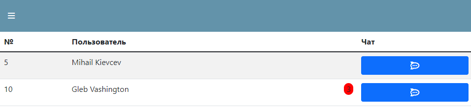
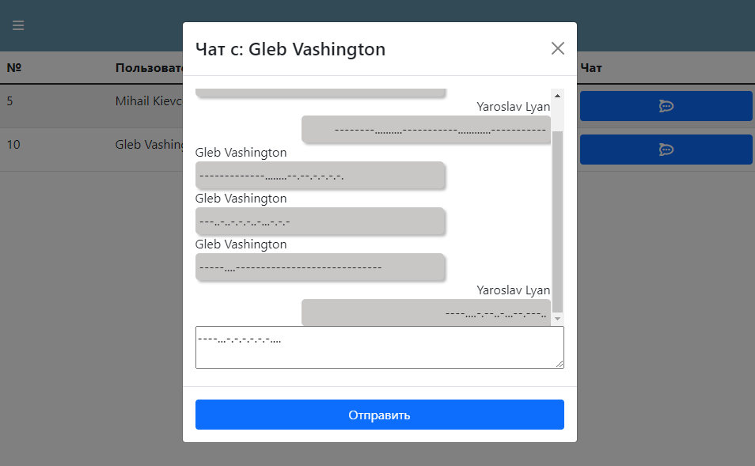
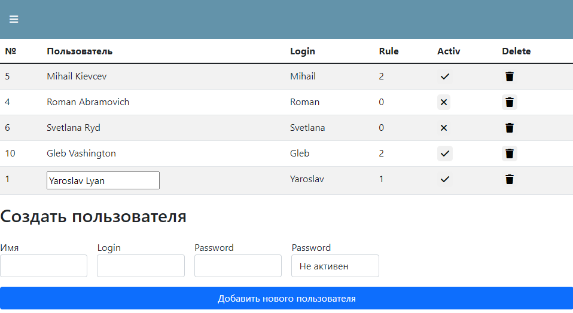

# Chat-server and client for Morse code communication - Front-End

## Test task - writing a chat server for communication in Morse code. Implementation features:
- messages to the client are entered and displayed only using the Morse code
- communication is only possible between 2 chat subscribers
- communication is possible only between authorized users
- you need to specify the name of the recipient and the text to send a message
- different access levels
- the server should not store the history of correspondence
- user management page (add / ban / remove users)

Deployed: https://chat-server-morsa-app.herokuapp.com/
login: Yaroslav
Password: 123456

Back-end: https://github.com/YaroslavLyan/Chat-server-Back-end

List users

Chat

User Management Page

## Used:
- React
- Redux
- Axios
- Bootstrap